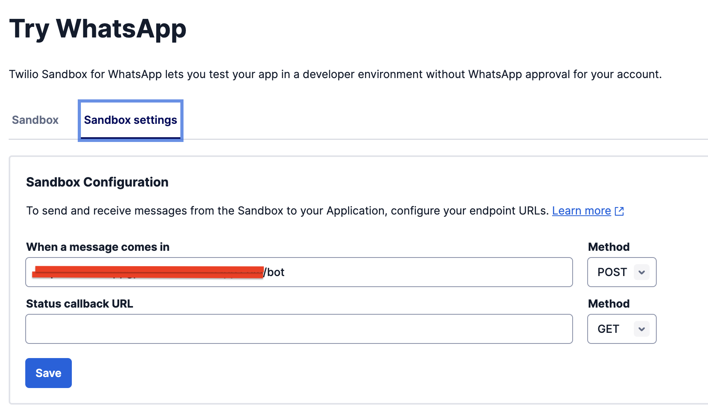

# WhatsAppGPT

### This is a simple implementation of gpt3.5-turbo model from OpenAI API whithin a twilio WhatsApp Sandbox.

    

## Steps 

Usage :nut_and_bolt:

1. Fork this repo (Don't forget to put your OpenAI Keys envs)

2. Deploy to Heroku 

3. Create twilio account and follow the steps to create WhatsApp Sandbox

4. In the Sandbox Settings put your heroku server link with POST Method (this will enable the comunication between the OpenAI API and your Sandbox)

    

5. Let's test.

    

